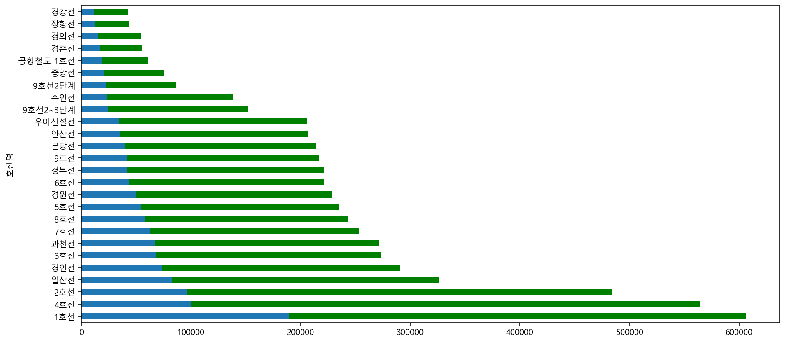
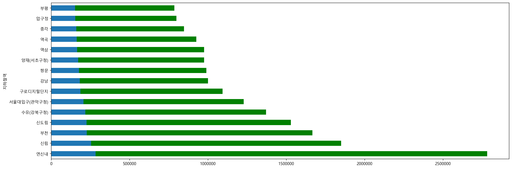
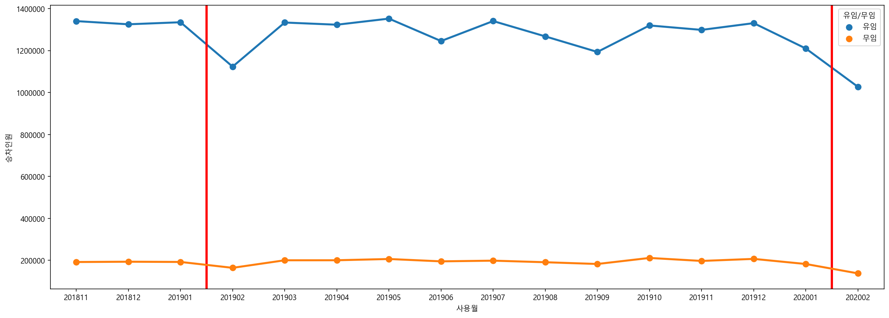

## 유/무임 승차 인원
* 데이터 출처 : [서울 열린데이터 광장](https://data.seoul.go.kr/dataList/OA-12251/S/1/datasetView.do)


```python
# 라이브러리 및 설정
import pandas as pd
import numpy as np

import seaborn as sns
import matplotlib.pyplot as plt
plt.rc('font', family='Malgun Gothic')
plt.rc('axes', unicode_minus=False)

from IPython.display import set_matplotlib_formats
set_matplotlib_formats('retina')
```


```python
# 데이터를 불러옵니다. 
df = pd.read_csv("./data/서울시 지하철 호선별 역별 유_무임 승하차 인원 정보.csv", encoding='cp949')
df.head()
```


<div>
<style scoped>
    .dataframe tbody tr th:only-of-type {
        vertical-align: middle;
    }

    .dataframe tbody tr th {
        vertical-align: top;
    }

    .dataframe thead th {
        text-align: right;
    }
</style>
<table border="1" class="dataframe">
  <thead>
    <tr style="text-align: right;">
      <th></th>
      <th>사용월</th>
      <th>호선명</th>
      <th>지하철역</th>
      <th>유임승차인원</th>
      <th>무임승차인원</th>
      <th>유임하차인원</th>
      <th>무임하차인원</th>
      <th>작업일자</th>
    </tr>
  </thead>
  <tbody>
    <tr>
      <th>0</th>
      <td>202002</td>
      <td>중앙선</td>
      <td>덕소</td>
      <td>105922</td>
      <td>36011</td>
      <td>104977</td>
      <td>36280</td>
      <td>20200303</td>
    </tr>
    <tr>
      <th>1</th>
      <td>202002</td>
      <td>중앙선</td>
      <td>상봉(시외버스터미널)</td>
      <td>120902</td>
      <td>29446</td>
      <td>117268</td>
      <td>27753</td>
      <td>20200303</td>
    </tr>
    <tr>
      <th>2</th>
      <td>202002</td>
      <td>중앙선</td>
      <td>신원</td>
      <td>2395</td>
      <td>2085</td>
      <td>2201</td>
      <td>1739</td>
      <td>20200303</td>
    </tr>
    <tr>
      <th>3</th>
      <td>202002</td>
      <td>중앙선</td>
      <td>도농</td>
      <td>191556</td>
      <td>42978</td>
      <td>171079</td>
      <td>41851</td>
      <td>20200303</td>
    </tr>
    <tr>
      <th>4</th>
      <td>202002</td>
      <td>중앙선</td>
      <td>지평</td>
      <td>515</td>
      <td>527</td>
      <td>386</td>
      <td>420</td>
      <td>20200303</td>
    </tr>
  </tbody>
</table>
</div>


```python
df.info()
```

    <class 'pandas.core.frame.DataFrame'>
    RangeIndex: 42491 entries, 0 to 42490
    Data columns (total 8 columns):
     #   Column  Non-Null Count  Dtype 
    ---  ------  --------------  ----- 
     0   사용월     42491 non-null  int64 
     1   호선명     42491 non-null  object
     2   지하철역    42491 non-null  object
     3   유임승차인원  42491 non-null  int64 
     4   무임승차인원  42491 non-null  int64 
     5   유임하차인원  42491 non-null  int64 
     6   무임하차인원  42491 non-null  int64 
     7   작업일자    42491 non-null  int64 
    dtypes: int64(6), object(2)
    memory usage: 2.6+ MB
    


```python
# 작년 12월 ~ 2월과 추이를 비교하기 위해서 그 이전 데이터는 제거합니다.  
drop_index = df[df['사용월'] < 201811].index
df.drop(drop_index, inplace=True)
```


```python
# 필요없는 컬럼은 제거합니다. 
df = df.drop(['작업일자'], axis=1).copy()
df.head()
```


<div>
<style scoped>
    .dataframe tbody tr th:only-of-type {
        vertical-align: middle;
    }

    .dataframe tbody tr th {
        vertical-align: top;
    }

    .dataframe thead th {
        text-align: right;
    }
</style>
<table border="1" class="dataframe">
  <thead>
    <tr style="text-align: right;">
      <th></th>
      <th>사용월</th>
      <th>호선명</th>
      <th>지하철역</th>
      <th>유임승차인원</th>
      <th>무임승차인원</th>
      <th>유임하차인원</th>
      <th>무임하차인원</th>
    </tr>
  </thead>
  <tbody>
    <tr>
      <th>0</th>
      <td>202002</td>
      <td>중앙선</td>
      <td>덕소</td>
      <td>105922</td>
      <td>36011</td>
      <td>104977</td>
      <td>36280</td>
    </tr>
    <tr>
      <th>1</th>
      <td>202002</td>
      <td>중앙선</td>
      <td>상봉(시외버스터미널)</td>
      <td>120902</td>
      <td>29446</td>
      <td>117268</td>
      <td>27753</td>
    </tr>
    <tr>
      <th>2</th>
      <td>202002</td>
      <td>중앙선</td>
      <td>신원</td>
      <td>2395</td>
      <td>2085</td>
      <td>2201</td>
      <td>1739</td>
    </tr>
    <tr>
      <th>3</th>
      <td>202002</td>
      <td>중앙선</td>
      <td>도농</td>
      <td>191556</td>
      <td>42978</td>
      <td>171079</td>
      <td>41851</td>
    </tr>
    <tr>
      <th>4</th>
      <td>202002</td>
      <td>중앙선</td>
      <td>지평</td>
      <td>515</td>
      <td>527</td>
      <td>386</td>
      <td>420</td>
    </tr>
  </tbody>
</table>
</div>


```python
df.groupby(['호선명'])['유임승차인원'].median().sort_values(ascending=False).plot.barh(figsize=(15, 7), color='green')
df.groupby(['호선명'])['무임승차인원'].median().sort_values(ascending=False).plot.barh(figsize=(15, 7))
```


    <matplotlib.axes._subplots.AxesSubplot at 0x1ec29c91b88>





```python
# 호선명에서 유/무임 승차인원이 많은 노선 10개만 line_df 에 담아줍니다. 
# df['호선명'].unique()

pay_index = line_df.groupby(['호선명'])['유임승차인원'].median().sort_values(ascending=False).head(15).index
# print(pay_index)
nonpay_index = line_df.groupby(['호선명'])['무임승차인원'].median().sort_values(ascending=False).head(15).index
# print(nonpay_index)

line_list = []
for element in pay_index:
    if element in nonpay_index:
        line_list.append(element)
print(line_list)

line_df = df[df['호선명'].isin(line_list)]
line_df
```

    ['2호선', '4호선', '1호선', '7호선', '3호선', '경인선', '과천선', '분당선', '8호선', '안산선']
    


<div>
<style scoped>
    .dataframe tbody tr th:only-of-type {
        vertical-align: middle;
    }

    .dataframe tbody tr th {
        vertical-align: top;
    }

    .dataframe thead th {
        text-align: right;
    }
</style>
<table border="1" class="dataframe">
  <thead>
    <tr style="text-align: right;">
      <th></th>
      <th>사용월</th>
      <th>호선명</th>
      <th>지하철역</th>
      <th>유임승차인원</th>
      <th>무임승차인원</th>
      <th>유임하차인원</th>
      <th>무임하차인원</th>
    </tr>
  </thead>
  <tbody>
    <tr>
      <th>49</th>
      <td>202002</td>
      <td>안산선</td>
      <td>반월</td>
      <td>88209</td>
      <td>21182</td>
      <td>81820</td>
      <td>20982</td>
    </tr>
    <tr>
      <th>50</th>
      <td>202002</td>
      <td>안산선</td>
      <td>오이도</td>
      <td>196764</td>
      <td>24494</td>
      <td>187681</td>
      <td>23809</td>
    </tr>
    <tr>
      <th>51</th>
      <td>202002</td>
      <td>안산선</td>
      <td>초지</td>
      <td>86320</td>
      <td>10359</td>
      <td>85386</td>
      <td>10437</td>
    </tr>
    <tr>
      <th>52</th>
      <td>202002</td>
      <td>안산선</td>
      <td>고잔</td>
      <td>172297</td>
      <td>24382</td>
      <td>168722</td>
      <td>23851</td>
    </tr>
    <tr>
      <th>53</th>
      <td>202002</td>
      <td>안산선</td>
      <td>수리산</td>
      <td>79518</td>
      <td>22489</td>
      <td>60660</td>
      <td>21045</td>
    </tr>
    <tr>
      <th>...</th>
      <td>...</td>
      <td>...</td>
      <td>...</td>
      <td>...</td>
      <td>...</td>
      <td>...</td>
      <td>...</td>
    </tr>
    <tr>
      <th>16107</th>
      <td>201811</td>
      <td>1호선</td>
      <td>청량리(서울시립대입구)</td>
      <td>493565</td>
      <td>322074</td>
      <td>517920</td>
      <td>330485</td>
    </tr>
    <tr>
      <th>16108</th>
      <td>201811</td>
      <td>1호선</td>
      <td>시청</td>
      <td>736654</td>
      <td>109764</td>
      <td>728341</td>
      <td>107291</td>
    </tr>
    <tr>
      <th>16109</th>
      <td>201811</td>
      <td>1호선</td>
      <td>서울역</td>
      <td>1618328</td>
      <td>230879</td>
      <td>1495023</td>
      <td>220568</td>
    </tr>
    <tr>
      <th>16110</th>
      <td>201811</td>
      <td>1호선</td>
      <td>동묘앞</td>
      <td>190029</td>
      <td>147814</td>
      <td>204819</td>
      <td>151101</td>
    </tr>
    <tr>
      <th>16111</th>
      <td>201811</td>
      <td>1호선</td>
      <td>동대문</td>
      <td>327967</td>
      <td>136953</td>
      <td>370295</td>
      <td>142534</td>
    </tr>
  </tbody>
</table>
<p>7128 rows × 7 columns</p>
</div>


```python
# 지하철역에서 유/무임 승차인원이 많은 역을 station_df 에 담아줍니다. 
# line_df['지하철역'].nunique()

pay_index = line_df.groupby(['지하철역'])['유임승차인원'].median().sort_values(ascending=False).head(30).index
# print(pay_index)
nonpay_index = line_df.groupby(['지하철역'])['무임승차인원'].median().sort_values(ascending=False).head(30).index
# print(nonpay_index)

station_list = []
for element in pay_index:
    if element in nonpay_index:
        station_list.append(element)
print(station_list)

station_df = line_df[line_df['지하철역'].isin(station_list)]
station_df
```

    ['강남', '신림', '구로디지털단지', '신도림', '서울대입구(관악구청)', '역삼', '종각', '양재(서초구청)', '부천', '연신내', '부평', '수유(강북구청)', '압구정', '쌍문', '역곡']
    


<div>
<style scoped>
    .dataframe tbody tr th:only-of-type {
        vertical-align: middle;
    }

    .dataframe tbody tr th {
        vertical-align: top;
    }

    .dataframe thead th {
        text-align: right;
    }
</style>
<table border="1" class="dataframe">
  <thead>
    <tr style="text-align: right;">
      <th></th>
      <th>사용월</th>
      <th>호선명</th>
      <th>지하철역</th>
      <th>유임승차인원</th>
      <th>무임승차인원</th>
      <th>유임하차인원</th>
      <th>무임하차인원</th>
    </tr>
  </thead>
  <tbody>
    <tr>
      <th>151</th>
      <td>202002</td>
      <td>경인선</td>
      <td>역곡</td>
      <td>579132</td>
      <td>112575</td>
      <td>568068</td>
      <td>115128</td>
    </tr>
    <tr>
      <th>153</th>
      <td>202002</td>
      <td>경인선</td>
      <td>부천</td>
      <td>699027</td>
      <td>143317</td>
      <td>702476</td>
      <td>144503</td>
    </tr>
    <tr>
      <th>154</th>
      <td>202002</td>
      <td>경인선</td>
      <td>부평</td>
      <td>726378</td>
      <td>104173</td>
      <td>791389</td>
      <td>105675</td>
    </tr>
    <tr>
      <th>453</th>
      <td>202002</td>
      <td>1호선</td>
      <td>종각</td>
      <td>872537</td>
      <td>112493</td>
      <td>849775</td>
      <td>105074</td>
    </tr>
    <tr>
      <th>487</th>
      <td>202002</td>
      <td>4호선</td>
      <td>수유(강북구청)</td>
      <td>763450</td>
      <td>157921</td>
      <td>759475</td>
      <td>158323</td>
    </tr>
    <tr>
      <th>...</th>
      <td>...</td>
      <td>...</td>
      <td>...</td>
      <td>...</td>
      <td>...</td>
      <td>...</td>
      <td>...</td>
    </tr>
    <tr>
      <th>16075</th>
      <td>201811</td>
      <td>2호선</td>
      <td>신도림</td>
      <td>1662963</td>
      <td>222343</td>
      <td>1658459</td>
      <td>212108</td>
    </tr>
    <tr>
      <th>16083</th>
      <td>201811</td>
      <td>2호선</td>
      <td>서울대입구(관악구청)</td>
      <td>1489594</td>
      <td>211496</td>
      <td>1445081</td>
      <td>204092</td>
    </tr>
    <tr>
      <th>16097</th>
      <td>201811</td>
      <td>2호선</td>
      <td>구로디지털단지</td>
      <td>1781496</td>
      <td>177661</td>
      <td>1774566</td>
      <td>180742</td>
    </tr>
    <tr>
      <th>16101</th>
      <td>201811</td>
      <td>2호선</td>
      <td>강남</td>
      <td>2889508</td>
      <td>182305</td>
      <td>2968644</td>
      <td>164120</td>
    </tr>
    <tr>
      <th>16105</th>
      <td>201811</td>
      <td>1호선</td>
      <td>종각</td>
      <td>1208704</td>
      <td>160156</td>
      <td>1148219</td>
      <td>149661</td>
    </tr>
  </tbody>
</table>
<p>405 rows × 7 columns</p>
</div>


```python
# pay_index[1]
```


    '홍대입구'


```python
station_df.groupby(['지하철역'])['유임승차인원'].median().sort_values(ascending=False).plot.barh(figsize=(20, 7), color='green')
station_df.groupby(['지하철역'])['무임승차인원'].median().sort_values(ascending=False).plot.barh(figsize=(20, 7))
```


    <matplotlib.axes._subplots.AxesSubplot at 0x1ec29a25108>





```python
station_df.shape
```


    (405, 7)


```python
# 하나의 데이터 셋에 승차인원과 유/무임 여부를 정리해줍니다. 
pay = station_df[['사용월', '호선명', '지하철역', '유임승차인원']]
pay['유임/무임'] = '유임'
pay = pay.rename(columns = {'유임승차인원' : '승차인원'})

npay = station_df[['사용월', '호선명', '지하철역', '무임승차인원']]
npay['유임/무임'] = '무임'
npay = npay.rename(columns = {'무임승차인원' : '승차인원'})

df_station = pd.concat([pay, npay])
df_station
```

    C:\Users\hongs\Anaconda3\lib\site-packages\ipykernel_launcher.py:2: SettingWithCopyWarning: 
    A value is trying to be set on a copy of a slice from a DataFrame.
    Try using .loc[row_indexer,col_indexer] = value instead
    
    See the caveats in the documentation: https://pandas.pydata.org/pandas-docs/stable/user_guide/indexing.html#returning-a-view-versus-a-copy
      
    C:\Users\hongs\Anaconda3\lib\site-packages\ipykernel_launcher.py:6: SettingWithCopyWarning: 
    A value is trying to be set on a copy of a slice from a DataFrame.
    Try using .loc[row_indexer,col_indexer] = value instead
    
    See the caveats in the documentation: https://pandas.pydata.org/pandas-docs/stable/user_guide/indexing.html#returning-a-view-versus-a-copy
      
    


<div>
<style scoped>
    .dataframe tbody tr th:only-of-type {
        vertical-align: middle;
    }

    .dataframe tbody tr th {
        vertical-align: top;
    }

    .dataframe thead th {
        text-align: right;
    }
</style>
<table border="1" class="dataframe">
  <thead>
    <tr style="text-align: right;">
      <th></th>
      <th>사용월</th>
      <th>호선명</th>
      <th>지하철역</th>
      <th>승차인원</th>
      <th>유임/무임</th>
    </tr>
  </thead>
  <tbody>
    <tr>
      <th>151</th>
      <td>202002</td>
      <td>경인선</td>
      <td>역곡</td>
      <td>579132</td>
      <td>유임</td>
    </tr>
    <tr>
      <th>153</th>
      <td>202002</td>
      <td>경인선</td>
      <td>부천</td>
      <td>699027</td>
      <td>유임</td>
    </tr>
    <tr>
      <th>154</th>
      <td>202002</td>
      <td>경인선</td>
      <td>부평</td>
      <td>726378</td>
      <td>유임</td>
    </tr>
    <tr>
      <th>453</th>
      <td>202002</td>
      <td>1호선</td>
      <td>종각</td>
      <td>872537</td>
      <td>유임</td>
    </tr>
    <tr>
      <th>487</th>
      <td>202002</td>
      <td>4호선</td>
      <td>수유(강북구청)</td>
      <td>763450</td>
      <td>유임</td>
    </tr>
    <tr>
      <th>...</th>
      <td>...</td>
      <td>...</td>
      <td>...</td>
      <td>...</td>
      <td>...</td>
    </tr>
    <tr>
      <th>16075</th>
      <td>201811</td>
      <td>2호선</td>
      <td>신도림</td>
      <td>222343</td>
      <td>무임</td>
    </tr>
    <tr>
      <th>16083</th>
      <td>201811</td>
      <td>2호선</td>
      <td>서울대입구(관악구청)</td>
      <td>211496</td>
      <td>무임</td>
    </tr>
    <tr>
      <th>16097</th>
      <td>201811</td>
      <td>2호선</td>
      <td>구로디지털단지</td>
      <td>177661</td>
      <td>무임</td>
    </tr>
    <tr>
      <th>16101</th>
      <td>201811</td>
      <td>2호선</td>
      <td>강남</td>
      <td>182305</td>
      <td>무임</td>
    </tr>
    <tr>
      <th>16105</th>
      <td>201811</td>
      <td>1호선</td>
      <td>종각</td>
      <td>160156</td>
      <td>무임</td>
    </tr>
  </tbody>
</table>
<p>810 rows × 5 columns</p>
</div>


```python
plt.figure(figsize=(20, 7))
plt.axvline(x=2.5, ymin=0, ymax=1, linewidth=3, color='red')
plt.axvline(x=14.5, ymin=0, ymax=1, linewidth=3, color='red')
# plt.axvline(x=14.8, ymin=0, ymax=1, linewidth=3, color='green')
sns.pointplot(data=df_station, x='사용월', y='승차인원', hue='유임/무임', ci=None)
```


    <matplotlib.axes._subplots.AxesSubplot at 0x1ec5cbab348>





* 2019년 1, 2월과 2020년 1, 2월을 비교했을때, 
* 특히, 무임 승차 인원이 크게 하락한 것을 알 수 있습니다. 


```python
# 지하철 추가...?
```


```python
pay_pivot = df.pivot_table(index='사용월', columns='지하철역', values='유임승차인원')
sns.heatmap(data=pay_pivot, annot=True, fmt='.0f', linewidths=5, cmap='Blues')
```


```python
npay_pivot = df.pivot_table(index='사용월', columns='지하철역', values='무임승차인원')

plt.figure(figsize=(8, 30))
sns.heatmap(data=npay_pivot, annot=True, fmt='.0f', linewidths=5, cmap='Blues')
```
